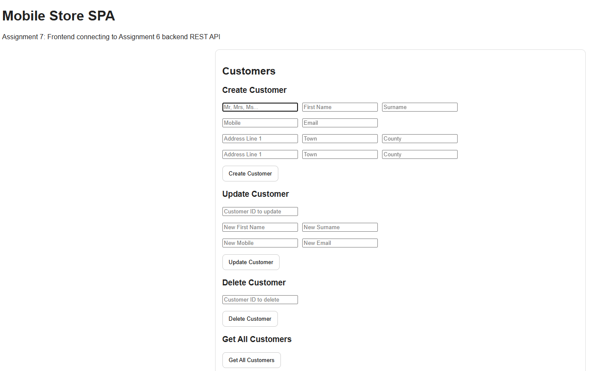

# Mobile Store SPA

A simple single-page application I built for my university assignment (Assignment 7). It connects to the REST API from Assignment 6 and lets me create, retrieve, update and delete customers, items and orders.

## Screenshot

## Features

- Create customers
- View customers
- Update customers
- Delete customers
- Create phone items
- View phone items
- Update phone items
- Delete phone items
- Create orders
- View orders
- Update orders
- Delete orders
- Connects to a REST API using fetch()

## Technologies Used

- HTML
- CSS
- JavaScript
- AJAX
- Node.js
- Express
- MongoDB

## What I Learned

This project was my first time building a single-page application that talks to a backend API.

I learned how to use AJAX with the Fetch API to send GET, POST, PUT and DELETE requests from JavaScript. Before this, I had only tested APIs with Postman, so it was cool to actually connect a frontend to them and bring everything I learned from this course together!

I also got a better understanding of the difference between the res object in Express and the response object returned by fetch(). In Express, res is used on the server to send data back to the client, while with fetch()` I receive a response from the server and have to convert it using .json() before I can use it.
